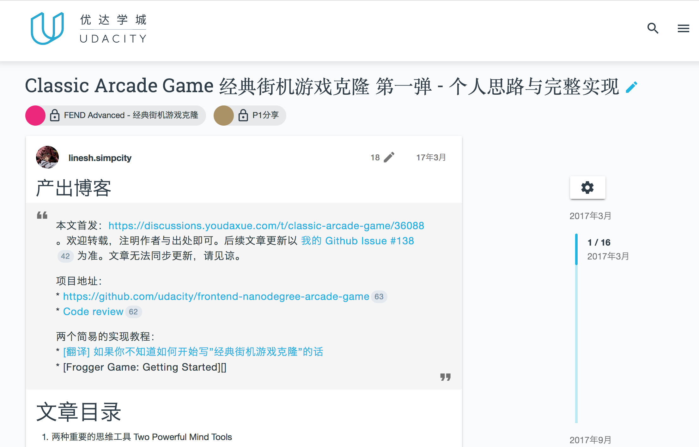
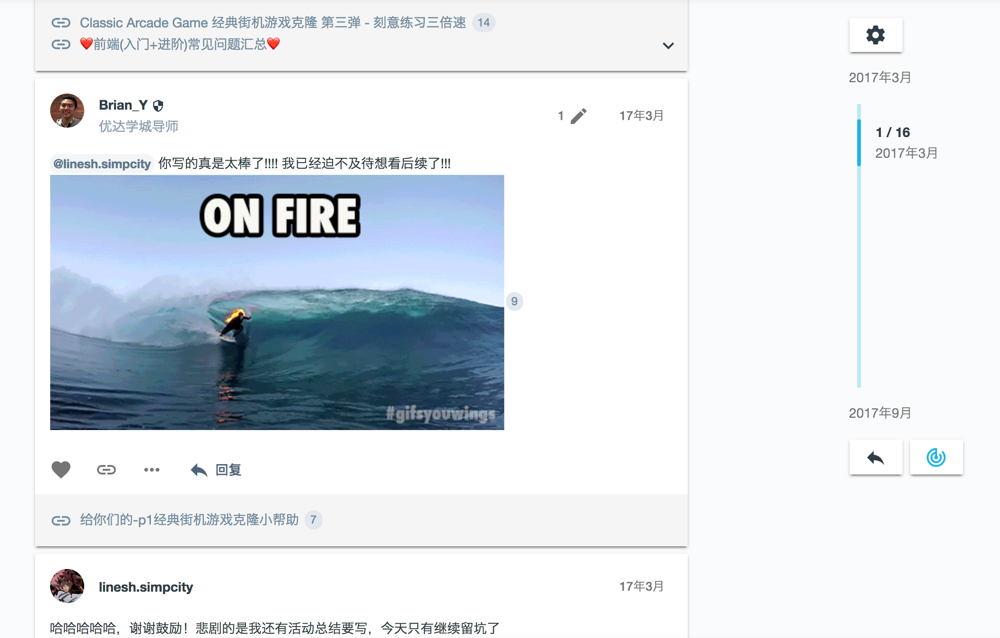

## 在线学习论坛

我们的导师随时在论坛准备回答你的问题，同时你也可以通过论坛，查找是否曾经有同学遇到相同的问题，更快的找到答案。

### 笔记池
分享你在前端开发纳米学位中的学习笔记，对你有帮助的资料以及你的思考。把自己的所学所想写成文字，分享给大家，对自己的帮助也很大哦！

我们会定期选取优秀的学员笔记，分享到知乎等博客。毕业后还可以获得优达工作人员独家采访，成为优达好榜样推送到公众号哟！

有任何问题？ 点击加入课程QQ咨询群 (QQ：684433016) ， 获得工作人员帮助和优先预定特权！

