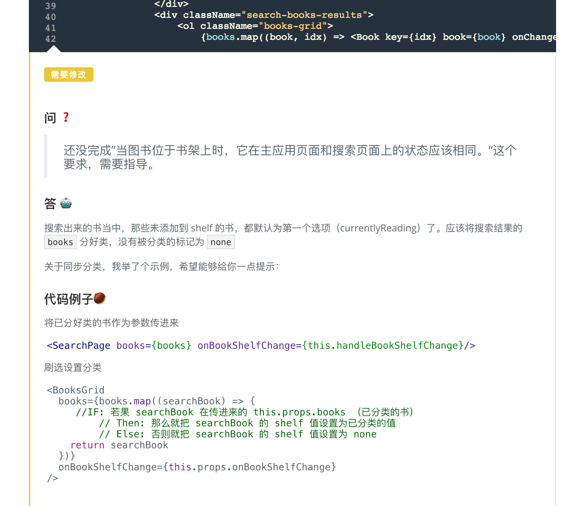
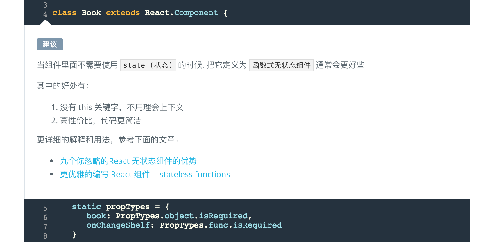
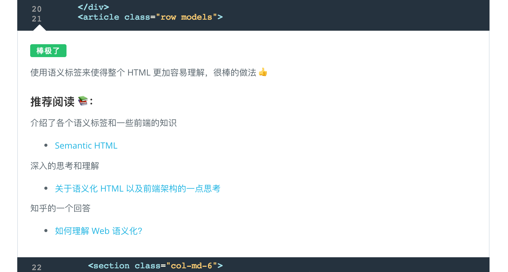

## 逐行代码审阅

在你提交项目后，我们将有行业经验丰富的评审师来你审阅提交的项目，为你提供细致到每行代码的审阅。 收到评审师反馈后，如果没有达到项目要求，你可以多次提交项目，让项目评审师提供指导，直到你找到正确方法，达到项目要求。

通过代码审阅，你可以知道自己的代码中做得不好的地方，同时学习到更好的编程习惯，更高效的编程思想，以及相当实用的编程技巧。

我们的反馈分为三种：

1. **需要修改**：该标记下的评注代表此行或此行附近的代码有不符合项目要求的地方，需要根据评论做出修改。

   

2. **建议**：该标记下的评注代表此行或此行附近的代码虽然符合项目要求，但不是最优写法，虽然不强制要求你对此做出修改，但我们推荐你根据评审师评论对项目做出优化。

   

3. **棒极了**：该标记下的评注代表此行或此行附近的代码写的非常棒，给予你鼓励并激励你编写出更出色的代码。往往评审师还会分享给你一些他/她的开发经验。

   

有任何问题？ 点击加入课程QQ咨询群 (QQ：684433016) ， 获得工作人员帮助和优先预定特权！

